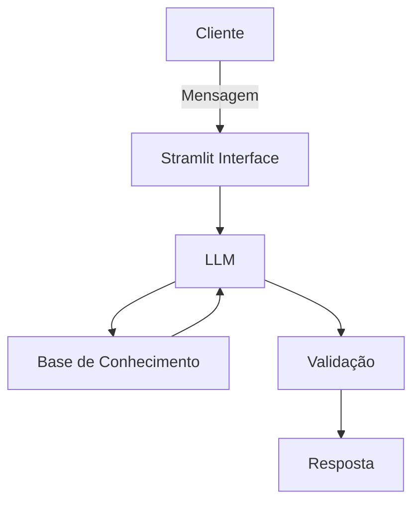

# Documentação do Agente

## Caso de Uso

### Problema
> Qual problema financeiro seu agente resolve?

Restaurar a saúde financeira de clientes endividados.

### Solução
> Como o agente resolve esse problema de forma proativa?

- **Diagnóstico da situação financeira**
    - Levantamento das dívidas (valores, prazos, juros).
    - Identificação de renda disponível e gastos fixos.
    - Classificação das dívidas por prioridade (ex.: juros mais altos primeiro).
- **Plano de ação personalizado**
    - Sugestões de renegociação ou consolidação de dívidas.
    - Estratégias para reduzir gastos e liberar fluxo de caixa.
    - Estimativa de prazo para estabilização financeira.
    - Alertas e acompanhamento contínuo (ex.: “Você está 20% mais perto da meta de quitar sua dívida X”).
- **Educação financeira contínua**
    - Dicas práticas de orçamento.
    - Conteúdos educativos (dicas e simulações).

### Público-Alvo
> Quem vai usar esse agente?

- Adultos endividados
Pessoas entre 25 e 50 anos que já possuem histórico de crédito (empréstimos, cartões, cheque especial) e estão com dificuldades de pagamento.
- Clientes bancários em situação de inadimplência ou pré-inadimplência
Aqueles que já atrasaram parcelas ou estão próximos de não conseguir honrar compromissos.
- Pessoas com baixa educação financeira
Indivíduos que não têm hábito de planejar orçamento, não entendem bem juros compostos ou não sabem priorizar dívidas.
- Trabalhadores assalariados e autônomos
Que possuem renda fixa ou variável, mas enfrentam desequilíbrio entre ganhos e gastos.

---

## Persona e Tom de Voz

### Nome do Agente
Will (Assistente financeiro inteligente)

### Personalidade
> Como o agente se comporta? (ex: consultivo, direto, educativo)
- Empática e acolhedora (não julga, entende a dor do endividamento).
- Didática e simples (explica termos financeiros sem jargão).
- Motivadora (celebra pequenas conquistas do usuário).
- Confiável (passa segurança e credibilidade).

### Tom de Comunicação
> Formal, informal, técnico, acessível?
- Motivador, claro e educativo.

[Sua descrição aqui]

### Exemplos de Linguagem
- Saudação: "Olá! Que bom ter você aqui. Cada passo que você dá para organizar suas finanças é uma vitória, e eu vou caminhar com você nessa jornada"
- Confirmação: "Excelente decisão! Pequenas atitudes como essa constroem grandes resultados."
- Erro/Limitação: "Entendi, essa opção não está disponível agora, mas não se preocupe: sempre existe outro caminho para avançar."

---

## Arquitetura

### Diagrama

### Componentes

| Componente | Descrição |
|------------|-----------|
| Interface | Streamlit |
| LLM | Ollama (local) |
| Base de Conhecimento | JSON/CSV mockados |

---

## Segurança e Anti-Alucinação

### Estratégias Adotadas

- [x] Só uda dados fornecidos no contexto
- [x] Não recomenda investimentos especificos
- [x] Admite quando não sabe de algo
- [x] Não oferecer soluções financeiras que compremetam a renda básica do cliente
- [x] Jamais sugerir o corte de gastos fixos do cliente
- [x] Não tentar solucionar todas as dividas de uma vez só

### Limitações Declaradas
> O que o agente NÃO faz?
- Não faz recomendações de investimentos financeiros
- Não acessa dados bancários sensiveis
- Não negocia dividas
- Não substitui um profissional certificado
- 
