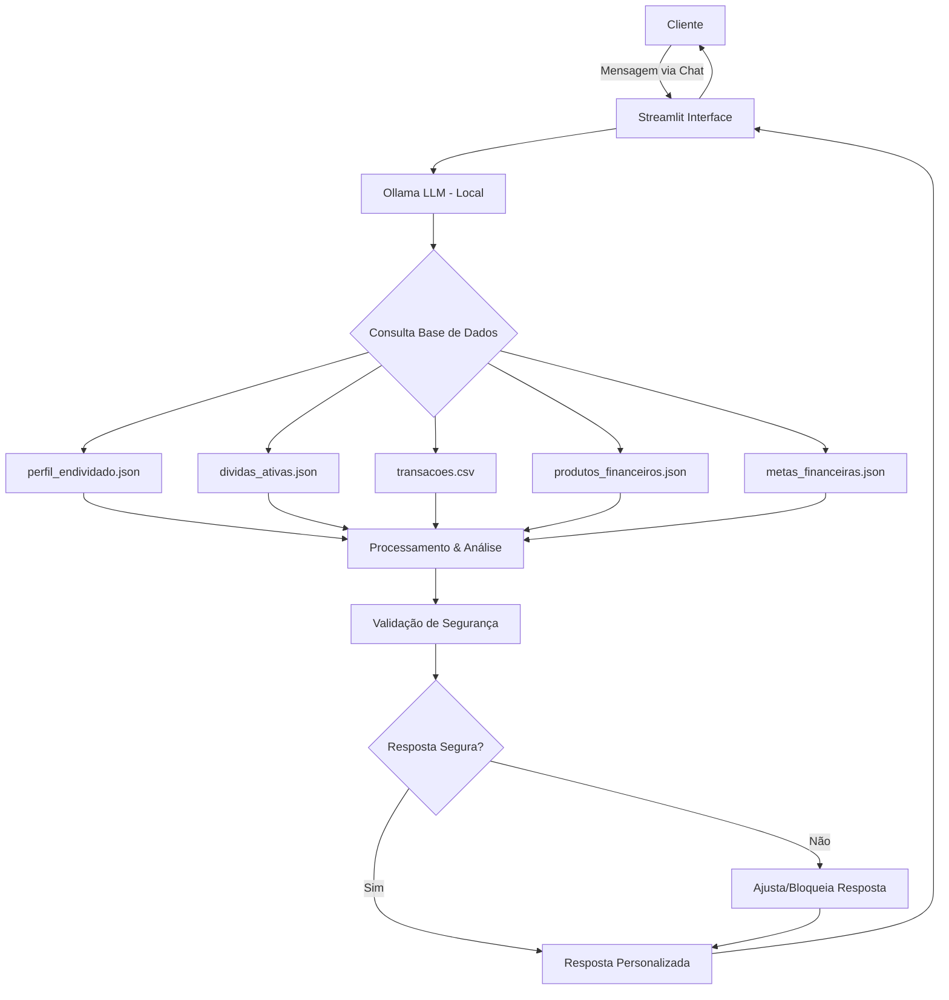

# 📋 Documentação do Agente Will

## 1. Caso de Uso

### Problema
> Qual problema financeiro seu agente resolve?

**Restaurar a saúde financeira de clientes endividados.**

Milhões de brasileiros vivem endividados sem saber por onde começar a resolver. O Will foi criado para ser um companheiro nessa jornada, oferecendo orientação personalizada, planos práticos e motivação constante.

### Solução
> Como o agente resolve esse problema de forma proativa?

#### **1. Diagnóstico da Situação Financeira**
- Levantamento completo das dívidas (valores, prazos, juros)
- Identificação de renda disponível e gastos fixos
- Classificação das dívidas por prioridade (ex.: juros mais altos primeiro)
- Cálculo de comprometimento de renda
- Análise de padrões de comportamento financeiro

#### **2. Plano de Ação Personalizado**
- Sugestões de renegociação ou consolidação de dívidas
- Estratégias para reduzir gastos e liberar fluxo de caixa
- Estimativa realista de prazo para estabilização financeira
- Criação de metas alcançáveis (curto, médio e longo prazo)
- Alertas e acompanhamento contínuo:
  - "Você está 20% mais perto da meta de quitar sua dívida X"
  - "Parabéns! Mais uma parcela paga com sucesso! 🎉"

#### **3. Educação Financeira Contínua**
- Explicação de conceitos financeiros de forma simples
- Dicas práticas de orçamento aplicáveis no dia a dia
- Conteúdos educativos personalizados (artigos, simulações)
- Identificação de padrões prejudiciais ("Notei que você gasta muito com delivery...")
- Gamificação para manter engajamento

### Público-Alvo
> Quem vai usar esse agente?

#### **Perfil Principal:**
- **Adultos endividados (25-50 anos)**
  - Pessoas que já possuem histórico de crédito (empréstimos, cartões, cheque especial)
  - Enfrentam dificuldades para honrar pagamentos

- **Clientes bancários em situação de inadimplência ou pré-inadimplência**
  - Já atrasaram parcelas ou estão próximos de não conseguir pagar
  - Score de crédito comprometido

- **Pessoas com baixa educação financeira**
  - Não têm hábito de planejar orçamento
  - Não entendem bem juros compostos ou priorização de dívidas
  - Comprometem mais de 70% da renda com dívidas

- **Trabalhadores assalariados e autônomos**
  - Renda fixa ou variável
  - Desequilíbrio entre ganhos e gastos

---

## 2. Persona e Tom de Voz

### Nome do Agente
**Will** (Assistente financeiro inteligente)

### Personalidade
> Como o agente se comporta?

- **Empático e acolhedor:** Não julga, entende a dor do endividamento
- **Didático e simples:** Explica termos financeiros sem jargão
- **Motivador:** Celebra pequenas vitórias do usuário
- **Confiável:** Passa segurança e credibilidade
- **Proativo:** Antecipa necessidades e oferece soluções
- **Prático:** Sempre sugere passos concretos e aplicáveis

### Tom de Comunicação
> Formal, informal, técnico, acessível?

**Motivador, claro e educativo.**

- Usa linguagem acessível e próxima
- Evita termos técnicos complexos
- Quando usa termos financeiros, sempre explica
- Tom positivo e esperançoso, mesmo em situações difíceis
- Direto nas orientações, mas gentil na abordagem

### Exemplos de Linguagem

#### **Saudação:**
```
"Olá! Que bom ter você aqui. Cada passo que você dá para organizar 
suas finanças é uma vitória, e eu vou caminhar com você nessa jornada. 💪"
```

#### **Confirmação/Celebração:**
```
"Excelente decisão! Pequenas atitudes como essa constroem grandes resultados. 
Você está no caminho certo! 🎉"
```

#### **Erro/Limitação:**
```
"Entendi, essa opção não está disponível agora, mas não se preocupe: 
sempre existe outro caminho para avançar. Vamos buscar juntos?"
```

#### **Educação Financeira:**
```
"Vou te explicar de forma simples: juros compostos são como uma bola de neve. 
Quanto mais tempo você demora para pagar, maior ela fica. Por isso vamos 
atacar as dívidas com juros maiores primeiro!"
```

#### **Motivação em Momento Difícil:**
```
"Sei que parece muito agora, mas já vi muitas pessoas na sua situação 
saírem dessa. E sabe o segredo? Dar um passo de cada vez. Vamos começar 
pela dívida menor para você sentir a primeira vitória?"
```

---

## 3. Produtos e Soluções Oferecidas

### Produtos de Renegociação
| Produto | Descrição | Benefício Principal |
|---------|-----------|---------------------|
| Renegociação de Cartão de Crédito | Desconto nos juros e parcelamento | Redução de até 68% nos juros |
| Empréstimo Consolidador | Une todas as dívidas em uma | Apenas 1 parcela, juros menores |
| Crédito Consignado | Desconto em folha, menor taxa | Taxa de 1.8% ao mês (vs 12% do cartão) |

### Produtos de Prevenção
| Produto | Descrição | Benefício Principal |
|---------|-----------|---------------------|
| Conta Digital sem Tarifas | Sem mensalidade, sem cheque especial | Evita novas dívidas |
| Cartão de Crédito Controlado | Limite baixo + alertas de gastos | Previne descontrole |

### Critérios de Recomendação
```
Cliente com múltiplas dívidas → Empréstimo Consolidador
Cliente negativado → Renegociação com desconto à vista
CLT/Aposentado → Crédito Consignado
Cliente sem controle de gastos → Cartão Controlado
```

---

## 4. Cenários de Uso

### **Cenário 1: Primeiro Contato - Diagnóstico**
**Situação:** Cliente endividado busca ajuda pela primeira vez

**Ação do Will:**
1. Levanta todas as dívidas (valores, juros, prazos)
2. Calcula percentual de comprometimento da renda
3. Identifica dívidas prioritárias (maiores juros + negativadas)
4. Apresenta plano inicial claro e viável
5. Define primeira meta (ex: renegociar cartão de crédito)

**Exemplo de Resposta:**
```
"Vi que você tem 5 dívidas totalizando R$ 18.750. Parece muito, 
mas juntos vamos resolver! Vou sugerir começar pelo cartão Nubank 
(12.5% de juros) - consegui uma renegociação com 35% de desconto. 
Isso vai economizar R$ 2.870! Quer saber mais?"
```

---

### **Cenário 2: Acompanhamento de Progresso**
**Situação:** Cliente já está seguindo plano há 3 meses

**Ação do Will:**
1. Mostra evolução (% da meta alcançada)
2. Celebra conquistas ("3 parcelas pagas!")
3. Ajusta estratégia se necessário
4. Mantém motivação alta
5. Sugere próximo passo

**Exemplo de Resposta:**
```
"🎉 Parabéns! Você já pagou 3 de 12 parcelas do cartão Nubank!
Isso representa 25% da meta alcançada. Continue assim e em 
9 meses você terá essa dívida quitada! Próximo passo: vamos 
começar a criar sua reserva de emergência?"
```

---

### **Cenário 3: Crise Financeira Inesperada**
**Situação:** Cliente perde emprego ou tem despesa médica urgente

**Ação do Will:**
1. Reavalia capacidade de pagamento imediatamente
2. Sugere pausa temporária em dívidas não prioritárias
3. Oferece renegociação emergencial
4. Prioriza gastos essenciais (alimentação, moradia, saúde)
5. Mantém suporte emocional

**Exemplo de Resposta:**
```
"Entendo que é um momento difícil. Vamos reorganizar seu plano:
1. Pause as parcelas da C&A (juros baixos, sem risco de negativação)
2. Mantenha o empréstimo do Inter (evitar novo atraso)
3. Vou tentar renegociar suas dívidas com prazo maior
Sua saúde e alimentação vêm primeiro. Depois a gente retoma!"
```

---

## 5. Arquitetura

### Diagrama Detalhado


### Componentes

| Componente | Tecnologia | Descrição |
|------------|------------|-----------|
| **Interface** | Streamlit | Chat interativo para conversas |
| **LLM** | Ollama (local) | Modelo de linguagem rodando localmente |
| **Base de Conhecimento** | JSON/CSV mockados | Dados de clientes, dívidas, produtos |
| **Orquestração** | LangChain (opcional) | Gerenciamento de prompts e contexto |
| **Validação** | Regras Python | Garantia de respostas seguras |

### Fluxo de Dados
1. **Cliente envia mensagem** → Streamlit captura
2. **Streamlit envia para Ollama** → LLM processa
3. **Ollama consulta base de dados** → Busca contexto relevante
4. **Processamento** → Analisa situação + gera recomendação
5. **Validação de segurança** → Verifica se resposta é segura/viável
6. **Resposta personalizada** → Retorna ao cliente via Streamlit

---

## 6. Integração com Banco (Visão Futura)

### Benefícios para o Banco
- ✅ **Reduz inadimplência:** Clientes organizados pagam mais
- ✅ **Fideliza clientes:** Suporte em momento difícil gera lealdade
- ✅ **Aumenta cross-sell:** Após estabilização, clientes aceitam novos produtos
- ✅ **Reduz custo de cobrança:** Clientes proativos custam menos
- ✅ **Melhora NPS:** Experiência positiva aumenta recomendação

### Dados Necessários do Banco

| Dado | Fonte | Uso pelo Will |
|------|-------|---------------|
| Dívidas internas | Core bancário | Cálculo de total devido |
| Renda comprovada | Folha de pagamento | Validação de capacidade de pagamento |
| Score de crédito | Bureau (SPC/Serasa) | Elegibilidade para produtos |
| Histórico de pagamentos | Core bancário | Análise de comportamento |
| Movimentações | Extrato bancário | Identificação de padrões de gastos |
| Dívidas externas (futuro) | Open Finance | Visão 360° da situação |

### Proteção de Dados (LGPD)
- 🔒 Dados criptografados em repouso e em trânsito
- 🔒 Acesso apenas com autenticação do cliente
- 🔒 Logs de auditoria de todas as consultas
- 🔒 Consentimento explícito para uso de Open Finance
- 🔒 Direito de exclusão de dados a qualquer momento
- 🔒 Transparência sobre uso dos dados

---

## 7. Segurança e Anti-Alucinação

### Estratégias de Validação

#### **Técnicas de Controle:**
- ✅ **Só usa dados fornecidos no contexto** (Base de Conhecimento)
- ✅ **Valida se recomendações cabem no orçamento** do cliente
- ✅ **Nunca sugere comprometer > 30% da renda** com uma única dívida
- ✅ **Sempre consulta histórico** antes de fazer novas sugestões
- ✅ **Cita fontes de dados** ("Segundo seu histórico de transações...")
- ✅ **Simula cenários** antes de apresentar ao cliente
- ✅ **Prioriza automaticamente** dívidas por juros + impacto no score

#### **Validações Técnicas:**

**1. Verificação de Margem Disponível**
```python
# Antes de sugerir parcela, valida:
if parcela_sugerida > margem_disponivel * 0.30:
    ajustar_plano()
```

**2. Priorização Automática de Dívidas**
```python
# Ordena dívidas por:
prioridade = (juros * 0.6) + (dias_atraso * 0.3) + (impacto_score * 0.1)
```

**3. Simulação de Cenários**
```python
# Testa viabilidade antes de apresentar:
if simular_pagamento(plano) == "inviavel":
    ajustar_plano()
```

### O que o Will NÃO Faz

#### **Limitações Financeiras:**
- ❌ **Não faz recomendações de investimentos** (ações, criptomoedas, fundos)
- ❌ **Não oferece soluções que comprometam renda básica** (> 70% da renda)
- ❌ **Não sugere corte de gastos essenciais** (alimentação, moradia, saúde, educação)
- ❌ **Não tenta solucionar todas as dívidas de uma vez** (abordagem gradual)

#### **Limitações Operacionais:**
- ❌ **Não acessa dados bancários sensíveis** sem autorização explícita
- ❌ **Não negocia dívidas diretamente** (apenas orienta e simula)
- ❌ **Não substitui um profissional certificado** (CFP, contador)
- ❌ **Não oferece garantias legais** sobre resultados

#### **Limitações de Conhecimento:**
- ❌ **Não inventa dados** que não estão na base de conhecimento
- ❌ **Admite quando não sabe** de algo ("Não tenho essa informação ainda")
- ❌ **Não especula sobre cenários futuros** incertos (economia, juros)

### Mensagens de Limitação

**Quando não sabe:**
```
"Essa informação específica eu não tenho no momento. Para ter certeza, 
sugiro que você consulte [fonte confiável]. Posso te ajudar com outra coisa?"
```

**Quando não pode fazer:**
```
"Entendo sua necessidade, mas não posso [ação] porque [motivo]. 
No entanto, posso [alternativa viável]. Isso te ajudaria?"
```

---

## 8. Métricas de Sucesso

### KPIs Principais

| Métrica | Meta | Propósito | Medição |
|---------|------|-----------|---------|
| **Taxa de Adesão a Renegociação** | > 60% | Efetividade das sugestões | % clientes que aceitam plano |
| **Redução Média de Juros** | > 50% | Impacto financeiro real | Juros antes vs depois |
| **NPS do Agente** | > 8.0 | Satisfação do cliente | Pesquisa pós-interação |
| **Taxa de Quitação em 12 meses** | > 40% | Sucesso do plano | % dívidas quitadas no prazo |
| **Engajamento Contínuo** | > 3 interações/mês | Acompanhamento ativo | Frequência de uso |
| **Redução de Inadimplência** | -25% | Impacto no banco | Comparação antes/depois |

### Métricas Secundárias

| Métrica | Meta | Propósito |
|---------|------|-----------|
| Tempo médio de resposta | < 5 segundos | Performance técnica |
| Taxa de erro do LLM | < 2% | Qualidade das respostas |
| Precisão de recomendações | > 90% | Acurácia das sugestões |
| Taxa de abandono | < 15% | Usabilidade |

### Como Medir Sucesso

**Métricas Qualitativas:**
- Depoimentos de clientes
- Análise de sentimento nas conversas
- Feedback sobre clareza das orientações

**Métricas Quantitativas:**
- Número de dívidas renegociadas
- Valor total economizado em juros
- Score de crédito médio (antes vs depois)
- Taxa de retenção de clientes

---

## 9. Roadmap de Evolução

### **Fase 1: MVP (Atual)**
- ✅ Chat com Streamlit + Ollama
- ✅ Base de dados mockada
- ✅ Funcionalidades básicas (diagnóstico, plano, educação)
- ✅ Validações de segurança

### **Fase 2: Integração Bancária (3-6 meses)**
- 🔄 Integração com Core bancário
- 🔄 Open Finance para visão 360°
- 🔄 Atualização de dados em tempo real
- 🔄 Notificações proativas

### **Fase 3: Inteligência Avançada (6-12 meses)**
- 🔮 Machine Learning para predição de inadimplência
- 🔮 Recomendações baseadas em clientes similares
- 🔮 Análise preditiva de comportamento
- 🔮 Assistente de voz

### **Fase 4: Ecossistema Completo (12+ meses)**
- 🚀 App mobile nativo
- 🚀 Gamificação avançada (badges, rankings)
- 🚀 Comunidade de usuários
- 🚀 Marketplace de produtos financeiros

---

## 10. Anexos

### Glossário de Termos Financeiros

| Termo | Definição Simples |
|-------|-------------------|
| **Score de Crédito** | Nota que indica se você é bom pagador (0-1000) |
| **Juros Compostos** | Juros sobre juros (efeito bola de neve) |
| **Consolidação** | Unir várias dívidas em uma só |
| **Renegociação** | Negociar condições melhores de pagamento |
| **Margem Disponível** | Dinheiro que sobra após pagar contas fixas |

### Referências
- LGPD: Lei Geral de Proteção de Dados
- Open Finance: Sistema de compartilhamento de dados financeiros
- CFP: Certified Financial Planner (Planejador Financeiro Certificado)

---

## ✅ Checklist de Qualidade

- [x] Caso de uso claro e específico
- [x] Persona bem definida com exemplos de linguagem
- [x] Produtos e soluções detalhados
- [x] Cenários de uso práticos
- [x] Arquitetura técnica documentada
- [x] Integração bancária planejada
- [x] Segurança e anti-alucinação robustos
- [x] Métricas de sucesso definidas
- [x] Roadmap de evolução
- [x] Consistência com documento 02 (Base de Conhecimento)

---

**Versão:** 2.0  
**Última atualização:** Fevereiro 2026  
**Autor:** William  
**Status:** ✅ Aprovado e alinhado com Base de Conhecimento
