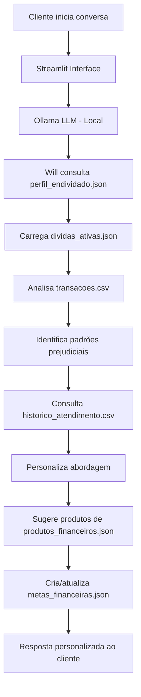

# 📊 Base de Conhecimento - Agente Will

## 1. Visão Geral

A base de conhecimento do **Will** foi estruturada para fornecer informações completas sobre a situação financeira de clientes endividados, permitindo diagnósticos precisos e recomendações personalizadas.

### Objetivo da Base de Dados
Permitir que o Will:
- ✅ Diagnostique a situação financeira completa do cliente
- ✅ Identifique padrões de comportamento que levam ao endividamento
- ✅ Sugira estratégias de renegociação personalizadas
- ✅ Acompanhe o progresso do cliente ao longo do tempo
- ✅ Ofereça educação financeira contextualizada

---

## 2. Estrutura de Dados

### 📁 Arquivos da Base de Conhecimento

```
data/
├── perfil_endividado.json          # Perfil completo do cliente
├── dividas_ativas.json             # Detalhamento de todas as dívidas
├── metas_financeiras.json          # Objetivos e planos do cliente
├── transacoes.csv                  # Histórico de movimentações
├── historico_atendimento.csv       # Interações anteriores com o banco
└── produtos_financeiros.json       # Soluções disponíveis para oferecer
```

---

## 3. Descrição Detalhada dos Arquivos

### 📄 **perfil_endividado.json**

**Propósito:** Armazena informações completas sobre o perfil socioeconômico e comportamental do cliente endividado.

**Estrutura Principal:**

| Seção | Campos Principais | Uso pelo Will |
|-------|-------------------|---------------|
| `cliente` | nome, idade, profissão, tempo_emprego | Personalização da comunicação |
| `situacao_financeira` | renda_mensal, gastos_fixos, margem_disponivel, score_credito | Cálculo de capacidade de pagamento |
| `dividas` | total_dividas, percentual_renda, tempo_endividado, status_negativado | Diagnóstico de gravidade |
| `comportamento_financeiro` | usa_cartao_credito, frequencia_atrasos, principal_problema | Identificação de padrões prejudiciais |
| `objetivos` | principal, prazo_desejado, motivacao | Alinhamento de estratégia |

**Exemplo de Uso:**
```
Cenário: Cliente com score 450 e 328% da renda em dívidas
Ação do Will: Priorizar renegociação com desconto, evitar novos créditos
```

**Campos Críticos para Decisão:**
- `margem_disponivel`: Define valor máximo de parcela viável
- `score_credito`: Indica produtos financeiros acessíveis
- `principal_problema`: Direciona educação financeira personalizada

---

### 📄 **dividas_ativas.json**

**Propósito:** Detalha cada dívida individualmente para priorização e estratégia de quitação.

**Estrutura Principal:**

| Campo | Descrição | Importância |
|-------|-----------|-------------|
| `tipo` | cartao_credito, emprestimo_pessoal, carnê_loja, etc | Identifica natureza da dívida |
| `juros_mes` | Taxa de juros mensal (%) | Priorização (maiores juros = maior urgência) |
| `dias_atraso` | Dias em atraso | Define urgência de renegociação |
| `status` | em_dia, atrasado, negativado | Impacto no score e estratégia |
| `prioridade` | alta, media, baixa | Ordem de quitação sugerida |
| `pode_renegociar` | true/false | Viabilidade de negociação |
| `desconto_vista` | Percentual de desconto disponível | Oportunidade de economia |

**Lógica de Priorização do Will:**

1. **Alta Prioridade:**
   - Dívidas com juros > 10% ao mês
   - Dívidas negativadas (impactam score)
   - Dívidas com possibilidade de desconto à vista > 30%

2. **Média Prioridade:**
   - Dívidas com juros entre 5-10% ao mês
   - Dívidas atrasadas (mas não negativadas)

3. **Baixa Prioridade:**
   - Parcelamentos sem juros
   - Dívidas em dia com juros < 5% ao mês

**Exemplo de Recomendação:**
```
DIV_001 (Cartão Nubank): 12.5% juros/mês + negativado + 35% desconto à vista
→ Will sugere: "Negocie AGORA com desconto de 35% e parcele em até 12x"

DIV_005 (Casas Bahia): 0% juros + em dia + sem desconto
→ Will sugere: "Mantenha pagamento normal, não priorize quitação antecipada"
```

---

### 📄 **metas_financeiras.json**

**Propósito:** Define objetivos do cliente e acompanha progresso.

**Tipos de Metas:**

| Tipo | Descrição | Uso pelo Will |
|------|-----------|---------------|
| `divida` | Quitar dívida específica | Gamificação e acompanhamento |
| `poupanca` | Criar reserva de emergência | Prevenção de novo endividamento |
| `habito` | Mudar comportamento financeiro | Educação e reforço positivo |

**Exemplo de Acompanhamento:**
```
Meta: Quitar cartão Nubank em 12 meses
Status: Mês 3 - 25% concluído
Mensagem do Will: "🎉 Parabéns! Você já pagou 3 de 12 parcelas. Continue assim!"
```

---

### 📄 **transacoes.csv**

**Propósito:** Histórico de movimentações financeiras para análise de padrões.

**Colunas Adicionadas para o Will:**

| Coluna | Valores Possíveis | Uso |
|--------|-------------------|-----|
| `categoria_divida` | pagamento_divida, gasto_essencial, gasto_nao_essencial, receita | Análise de comportamento |
| `tipo_pagamento` | debito, credito, boleto, PIX, transferencia | Identificar uso excessivo de crédito |

**Análises Realizadas pelo Will:**

1. **Padrão de Gastos:**
   - Percentual gasto com não-essenciais
   - Uso de cartão de crédito vs débito
   - Gastos recorrentes que podem ser cortados

2. **Compromisso de Renda:**
   - % da renda comprometida com dívidas
   - Margem disponível após gastos fixos

3. **Oportunidades de Economia:**
   ```
   Exemplo detectado:
   - Netflix + Amazon Prime + Spotify = R$ 89,90/mês
   Will sugere: "Que tal manter apenas 1 serviço de streaming e economizar R$ 60/mês?"
   ```

---

### 📄 **historico_atendimento.csv**

**Propósito:** Contexto de interações anteriores para continuidade.

**Colunas Adicionadas:**

| Coluna | Uso pelo Will |
|--------|---------------|
| `sentimento_cliente` | Ajustar tom de comunicação (ansioso → acolhedor, frustrado → empático) |
| `acao_tomada` | Evitar repetir orientações já dadas |

**Exemplo de Continuidade:**
```
Atendimento anterior (10/02): Cliente tentou renegociar cartão, mas desistiu por medo
Próximo atendimento (20/02): 
Will: "Lembro que você estava pensando em renegociar o cartão. 
Preparei uma simulação com desconto de 35% - quer que eu te mostre?"
```

---

### 📄 **produtos_financeiros.json**

**Propósito:** Catálogo de soluções que o Will pode oferecer.

**Categorias:**

#### 1. **Produtos de Renegociação:**
- Renegociação de Cartão de Crédito
- Empréstimo Consolidador
- Crédito Consignado

**Critérios de Recomendação:**
- Cliente com múltiplas dívidas → Empréstimo Consolidador
- Cliente negativado → Renegociação com desconto
- CLT/aposentado → Crédito Consignado (menor taxa)

#### 2. **Produtos de Prevenção:**
- Conta Digital Sem Tarifas (evita cheque especial)
- Cartão de Crédito Controlado (limite baixo + alertas)

**Exemplo de Oferta Contextualizada:**
```
Cliente: 5 dívidas diferentes, pagando R$ 1.550/mês
Will: "Você está pagando 5 contas separadas. Com o Empréstimo Consolidador, 
você unifica tudo em 1 parcela de R$ 890/mês. Economia de R$ 660/mês!"
```

---

## 4. Fluxo de Uso dos Dados pelo Will

O Will utiliza **Ollama (LLM local)** para processar as consultas dos clientes, garantindo privacidade e velocidade nas respostas. O modelo roda localmente, sem enviar dados sensíveis para a nuvem.

### Interface de Comunicação

O Will se comunica com os clientes através de uma **interface Streamlit**, que oferece:

- 💬 Chat interativo e responsivo  
- 📊 Visualização de gráficos (evolução de dívidas, progresso de metas)  
- 📁 Upload de documentos (extratos, comprovantes)  
- 🔔 Notificações em tempo real  
- 📱 Interface mobile-friendly  

**Fluxo típico:**
1. Cliente envia mensagem no chat Streamlit  
2. Streamlit encaminha para Ollama (LLM)  
3. Ollama consulta base de dados (JSON/CSV)  
4. Ollama processa e gera resposta personalizada  
5. Validação de segurança  
6. Resposta exibida no Streamlit  



---

## 5. Integração com Sistemas Externos (Futuro)

### 📡 **Open Finance**
- **Dados:** Dívidas externas, contas em outros bancos
- **Uso:** Visão completa da situação financeira

### 📊 **Bureaus de Crédito (SPC/Serasa)**
- **Dados:** Score atualizado, negativações
- **Uso:** Ofertas de produtos adequadas ao perfil

### 🏦 **Sistema Core Bancário**
- **Dados:** Movimentações em tempo real
- **Uso:** Alertas proativos de gastos

---

## 6. Governança e Segurança dos Dados

### 🔒 **Privacidade:**
- Dados sensíveis criptografados
- Acesso apenas com autenticação do cliente
- Conformidade com LGPD

### 🛡️ **Qualidade:**
- Validação de consistência entre arquivos
- Atualização automática de totais e percentuais
- Versionamento de mudanças

### ⚠️ **Limitações dos Dados Mockados:**
- Representam apenas 1 cliente fictício
- Dados simplificados para prototipação
- Em produção, integração com sistemas reais é essencial

---

## 7. Limitações e Restrições do Will

Para garantir segurança e conformidade, o Will possui limitações claras:

### Limitações Financeiras
- ❌ Não recomenda investimentos específicos (ações, fundos, criptomoedas)  
- ❌ Não sugere comprometer > 30% da renda mensal em uma única dívida  
- ❌ Não oferece corte de gastos essenciais (alimentação, moradia, saúde)  

### Limitações Operacionais
- ❌ Não negocia dívidas diretamente (apenas orienta)  
- ❌ Não acessa dados bancários sem autorização explícita  
- ❌ Não substitui profissional certificado (CFP, contador)  

### Limitações de Dados
- ❌ Só utiliza informações da Base de Conhecimento  
- ❌ Admite quando não tem informação disponível  
- ❌ Não especula sobre cenários econômicos futuros  

**Quando não sabe:**
```
"Essa informação eu não tenho disponível no momento. 
Sugiro consultar [fonte oficial]. Posso ajudar com outra coisa?"
```

**Quando não pode fazer:**
```
"Entendo sua necessidade, mas não posso fazer isso porque [motivo]. 
Mas posso [alternativa]. Isso ajudaria?"
```

---

## 8. Métricas de Uso da Base e KPIs

### Métricas Técnicas (Uso dos Dados)

| Métrica | Objetivo | Meta |
|---------|----------|------|
| Taxa de consultas a `dividas_ativas.json` | Medir foco em resolução de dívidas | 100% das conversas |
| Uso de `transacoes.csv` | Avaliar personalização | > 80% das recomendações |
| Conversão de produtos oferecidos | Efetividade das recomendações | > 60% |
| Atualização de `metas_financeiras.json` | Acompanhamento ativo | Semanal |

### KPIs de Negócio (Impacto Real)

| KPI | Meta | Medição |
|-----|------|---------|
| Taxa de Adesão a Renegociação | > 60% | % clientes que aceitam plano |
| Redução Média de Juros | > 50% | Comparação antes vs depois |
| NPS do Will | > 8.0 | Pesquisa pós-interação |
| Taxa de Quitação em 12 meses | > 40% | % dívidas quitadas no prazo |
| Redução de Inadimplência | -25% | Impacto no banco |

### Como Medir
- Logs de consulta aos arquivos JSON/CSV  
- Tempo de resposta das queries  
- Taxa de erro nas recomendações  
- Pesquisas de satisfação (NPS)  
- Análise de conversão (produtos oferecidos vs aceitos)  
- Comparação financeira (juros antes vs depois)  
- Acompanhamento de metas (progresso mensal)  

---

## 9. Evolução Futura da Base

### **Curto Prazo:**
- [ ] Adicionar histórico de score de crédito
- [ ] Incluir simulações de renegociação pré-calculadas

### **Médio Prazo:**
- [ ] Integração com Open Finance
- [ ] Histórico de metas alcançadas

### **Longo Prazo:**
- [ ] Machine Learning para predição de inadimplência
- [ ] Recomendações baseadas em comportamento de clientes similares

---

## 10. Exemplos Práticos de Uso

### Exemplo Prático 1: João Silva
**Cenário:** Cliente João entra em contato

**Passo 1:** Will carrega `perfil_endividado.json`
```
Nome: João Silva
Renda: R$ 5.700
Dívidas: R$ 18.750 (328% da renda)
Score: 450 (alto risco)
```

**Passo 2:** Will analisa `dividas_ativas.json`
```
Prioridade ALTA:
- Nubank: R$ 8.200 (12.5% juros) → Desconto de 35% disponível
- Vivo: R$ 680 (10% juros) → Desconto de 50% disponível
```

**Passo 3:** Will consulta `transacoes.csv`
```
Padrão detectado: Gastos com delivery (R$ 240/mês)
Oportunidade: Economizar R$ 150/mês cozinhando em casa
```
**Passo 4:** Will verifica `historico_atendimento.csv`
```
Última conversa: João estava ansioso sobre as dívidas
Tom de voz: Acolhedor e motivador
```

**Passo 5:** Will oferece solução de `produtos_financeiros.json`
```
Produto: Renegociação Nubank
Benefício: De R$ 8.200 para R$ 5.330 (35% desconto)
Parcela: R$ 445/mês (cabe no orçamento)
```

**Passo 6:** Will cria meta em `metas_financeiras.json`
```
Meta: Quitar Nubank em 12 meses
Economia total: R$ 2.870
Status: Em planejamento
```

**Resposta do Will:**
```
Oi João! 👋

Vi aqui que você tem R$ 18.750 em dívidas. Parece muito, mas 
juntos vamos resolver isso!

🎯 Tenho uma ótima notícia: consegui uma RENEGOCIAÇÃO especial 
para seu cartão Nubank:

✅ De R$ 8.200 → R$ 5.330 (35% de desconto!)
✅ 12 parcelas de R$ 445 (cabe no seu orçamento)
✅ Nome limpo em 1 ano

Além disso, notei que você gasta cerca de R$ 240/mês com delivery. 
Que tal reduzir para R$ 90? Você economiza R$ 150 extras para as dívidas!

Com essa estratégia, em 12 meses você quita a maior dívida e 
economiza R$ 2.870! 🚀

Quer que eu prepare o contrato de renegociação?
```

## 11. Validação da Base de Conhecimento

### ✅ **Checklist de Qualidade:**

- [x] Dados representam situação realista de endividamento
- [x] Campos permitem personalização das respostas
- [x] Informações suficientes para diagnóstico completo
- [x] Produtos financeiros alinhados com o problema
- [x] Métricas rastreáveis para avaliação de progresso
- [x] Estrutura escalável para novos clientes

---
## 📌 Conclusão

Esta base de conhecimento fornece ao **Will** todas as informações necessárias para:

1. ✅ Entender a situação financeira do cliente  
2. ✅ Identificar causas do endividamento  
3. ✅ Sugerir soluções personalizadas e viáveis  
4. ✅ Educar o cliente de forma contextualizada  
5. ✅ Acompanhar progresso e celebrar conquistas  

A estrutura está pronta para **prototipagem** e pode ser expandida com **dados reais** quando o Will for para produção.
